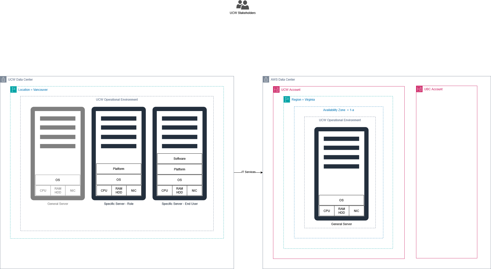

# Portfolio

## Descriptive Analysis

### Project Description: Descriptive Analysis of HR Recruitment Data.

### Project Title: Optimizing HR Recruitment: A Data-Driven Approach to Reduce Time-to-Hire.

### Objective:
The primary goal of this project is to reduce the time-to-hire by conducting a comprehensive descriptive analysis of recruitment data, pinpointing inefficiencies, and providing actionable insights.

### Dataset:
The dataset includes various HR recruitment application records, comprising features such as `DatasetName`, `BucketName`, `FolderName`, `Tag`, `Region`, `Application Dates`, `Status`, `Year`, `Quarter`, and `Month`, crucial for tracking the recruitment lifecycle.

### Methodology:

#### Data Collection and Preparation:
* Datasets were ingested and stored in an AWS S3 data lake (e.g., `hr-raw-pra` bucket), leveraging cloud storage for scalability.
* Data Profiling was performed to understand data quality, identify anomalies, and define data characteristics (as detailed in initial analysis phases).
* Data Cleaning Implementation was executed to address identified inconsistencies, missing values, and transform raw data into a clean, usable format suitable for analysis. This involved designing and executing processes to ensure data integrity.
* Datalake Design: A structured data lake design was developed, outlining appropriate keyword, dataset names, and S3 folder locations (`Recruitment Applications/Year 25/Quarter Q2/Month April`) to organize ingested data efficiently.

#### Descriptive Statistics:
* Key recruitment metrics were analyzed, including application volumes over time, average duration of each recruitment stage (e.g., screening time, interview rounds), and conversion rates at various funnel points.

#### Data Visualization:
* Visual representations, such as the Fishbone Diagram, were created to visually identify and categorize root causes for recruitment delays, highlighting factors like "Feedback delay," "High volume of applications," and "Too many interview rounds."

* ETL analysis components were also visualized to understand data flow and transformation.

#### Process Bottleneck Analysis:
* Beyond general statistics, a focused analysis, guided by the Fishbone Diagram, dissected the recruitment process to pinpoint specific bottlenecks. This involved examining "Cause Factors" such as "Delays in screening" and "Slow decision making for final interviews" as critical areas for intervention.

#### Insights and Findings:
* Analysis revealed that key delays stemmed from inefficient feedback loops, overwhelming application volumes, and prolonged interview cycles. Specific insights were derived from ETL analysis to understand how data could be enriched and summarized to answer critical business questions.

#### Recommendations:
* Actionable recommendations were formulated to streamline the process, including proposals for automating initial screening, optimizing the number of interview rounds, and improving cross-departmental communication to expedite decision-making, aiming for a measurable reduction in time-to-hire.

### Tools and Technologies:
* AWS S3 for scalable data storage and data lake foundation.
* AWS Glue for Extract, Transform, Load (ETL) processes, including data cleaning and schema management, with cost evaluation performed.
* Data analysis and visualization tools for data profiling, statistical analysis, and creating insightful diagrams (e.g., Fishbone).
* Supporting documentation for ETL analysis, business question mapping, and data enrichment/summarization.

### Deliverables:
* Comprehensive progress reports detailing methodology, findings, and recommendations.
* Visualizations, including Fishbone diagrams, to illustrate root causes and process flow.
* Detailed data lake and ETL design documentation.

## AWS Deployment and Service Models

This portfolio section showcases a deep understanding of cloud computing, encompassing fundamental models, deployment strategies, service types, and global infrastructure components, all illustrated through detailed architectural diagrams and comparative tables. It begins by contrasting **Traditional Computing** (on-premises physical infrastructure managed by the organization) with the agility and scalability of the **Cloud Computing Model** (leveraging AWS global infrastructure and virtual servers).

### Case Study #1

Module 1 Knowledge Test

### Case Study #2

Building upon this foundation, the portfolio explores diverse cloud deployment strategies. It differentiates **Private Cloud** (on-premises, full organizational control), **Public Cloud** (hosted on third-party provider infrastructure like AWS, offering global access), **Hybrid Cloud** (a seamless blend of on-premises and public cloud environments), and **Multi-Cloud** (distributing workloads across multiple public cloud providers, such as AWS and Azure, for enhanced resilience and flexibility). Each model is analyzed for its implications on data location, access mechanisms, and privacy responsibilities.

### Case Study #3

Furthermore, the exhibit delves into various cloud service models:
* **Infrastructure as a Service (IaaS)** provides virtualized computing resources where the user manages operating systems and applications.
* **Platform as a Service (PaaS)** abstracts the underlying infrastructure, allowing users to focus solely on application development and deployment.
* **Software as a Service (SaaS)** offers ready-to-use applications managed entirely by the vendor, requiring minimal user intervention. These distinctions highlight the evolving shared responsibility model in the cloud.

Module 2 Knowledge Test

## AWS Cost Analysis

### Case Study #4

This portfolio entry analyzes a case study focused on optimizing the **Total Cost of Ownership (TCO)** for a rapidly growing global company with over 200 locations, 500 million customers, and $3 billion in annual revenue. Faced with challenges such as the need for rapid solution deployment and constant equipment upgrades, the company sought a broad IT solution that would improve efficiency, lower costs, eliminate busy work like patching, and deliver a positive return on investment (ROI). The strategic decision was made to migrate their on-premises data center to AWS, a significant undertaking that involved eliminating 90 percent (205) of their physical servers, moving nearly all applications to the cloud, and leveraging 3-year Amazon EC2 Reserved Instances for cost predictability. This comprehensive cloud adoption resulted in substantial benefits, including **Resource Optimization** through elastic scaling and reduced physical infrastructure, improved **Speed to Market** for new solutions, and enhanced **Operational Efficiency** by offloading infrastructure management and automating routine tasks, collectively demonstrating a successful transformation that significantly reduced the overall TCO and aligned IT with aggressive business growth objectives.

### Case Study #5

In this project, a thorough **Cost Evaluation** was performed to assess the financial viability and resource allocation for the data initiative, ensuring efficient use of budget and alignment with project goals. This was followed by comprehensive **Data Profiling**, which involved analyzing the raw datasets to understand their structure, content, and identify quality issues such as missing values, inconsistencies, or anomalies. Finally, a robust **Data Cleaning Implementation** strategy was executed to address these identified data quality problems, transforming the raw, inconsistent data into a clean, reliable, and usable format essential for subsequent analysis and successful project outcomes.

### Case Study #6

For the "City of Vancouver 2019-2021 capital plan dataset" project, the **AWS Developer Support plan** is generally most suitable. It offers sufficient technical guidance and best practice checks for development or non-critical data analysis, providing cost-effective support without the need for 24/7 enterprise-level assistance.

Module 2 Knowledge Check Results

## AWS Global Infrastructure

### Case Study #7

This table outlines the recommended AWS Developer Support plan for the City of Vancouver Data Team. This choice is justified by its cost-effectiveness, providing a balance of guidance and resources suitable for data exploration and analysis projects. It offers essential technical support without the need for 24/7 production-level assistance.

Module 3 Knowledge Check Results

## AWS IAM

### Case Study #8

### Case Study #9 IAM practice Lab 1

This lab provided hands-on experience with AWS Identity and Access Management (IAM), demonstrating the creation and management of users and groups. I successfully applied pre-defined and inline policies to grant specific permissions, such as read-only access to S3 or EC2, and administrative control over EC2 instances. This practical exercise solidified my understanding of access control principles and the critical role of IAM in securing AWS resources by enforcing the principle of least privilege.

Module 4 Knowledge Check results

## AWS VPC

This lab provided hands-on experience in building a custom network infrastructure on AWS using Amazon Virtual Private Cloud (VPC). I successfully created a VPC with public and private subnets across multiple Availability Zones, configured Internet and NAT Gateways for controlled internet access, and established comprehensive routing tables and security groups. Finally, I launched and configured an EC2 instance as a functional web server within this secure, custom VPC environment, demonstrating proficiency in core AWS networking and compute services.

Module 5 Knowledge Check results

## AWS Lambda

This lab provided practical experience in serverless automation by building an AWS Lambda function, dubbed a "Stopinator." I configured the Python-based Lambda to automatically stop a specified EC2 instance, triggered by a recurring schedule via Amazon EventBridge. This exercise demonstrated proficiency in creating and deploying serverless functions, integrating AWS services for automated resource management, and implementing cost-saving measures through programmatic control of compute resources.

Module 6 Knowledge Check results

## AWS EBS

This lab provided practical experience with Amazon Elastic Block Store (EBS), demonstrating its role as persistent block storage for EC2 instances. I successfully created and attached a new EBS volume, formatted it with a file system, and mounted it to a Linux EC2 instance. Crucially, I performed a point-in-time snapshot of the volume and subsequently restored it to a new volume, showcasing essential data backup, recovery, and durability capabilities within AWS.

Module 7 Knowledge Check results

